# livegeo: design handoff

For the UI/UX designer taking over the look and feel of livegeo. This document covers:

- what exists today;
- how each screen behaves;
- the rules the design must not break;
- what is known to be wrong or missing;
- how to work with the code.

Original handoff: 23 September 2026. Dashboard renderer/vocabulary/constraints updated for the WebGL redesign on 24 September 2026. Historical screenshots below describe the earlier UI; current reference implementation notes are in [reference-map](reference-map/README.md). The [game-map](game-map/README.md) captures are historical.

Screenshots are in [`docs/design-handoff/`](design-handoff/). They were taken on a local copy with made-up people (Leo, May, Kai) and **placeholder map tiles** (the grid city). The current dashboard styles its local OSM geometry itself; the raster street map is optional.

---

## Contents

1. [The short version](#1-the-short-version)
2. [What livegeo is, and who uses it](#2-what-livegeo-is-and-who-uses-it)
3. [Every surface, screen by screen](#3-every-surface-screen-by-screen)
4. [The map's visual vocabulary](#4-the-maps-visual-vocabulary)
5. [The visual language today (tokens)](#5-the-visual-language-today-tokens)
6. [Flows](#6-flows)
7. [Rules the design must not break](#7-rules-the-design-must-not-break)
8. [Technical constraints and warnings](#8-technical-constraints-and-warnings)
9. [Accessibility: where it stands](#9-accessibility-where-it-stands)
10. [Known problems and opportunities](#10-known-problems-and-opportunities)
11. [Questions for the product owner](#11-questions-for-the-product-owner)
12. [Working with engineering](#12-working-with-engineering)
13. [Appendix: where every piece of copy lives](#13-appendix-where-every-piece-of-copy-lives)

---

## 1. The short version

**What it is.** A private, live map of people who share their location through a Telegram bot, or from a watch. Each person sees only their *circle*: people who chose to let them see.

Around the map are safety features, loosely modelled on ride-hailing apps' safety tools:
- a link anyone can follow you on for a while;
- an SOS;
- "check on me";
- private places, where your circle sees a blur instead of your position.

**Where the UI is.**
- Four web pages: the map, the page a live link opens, the page a shared path opens, and sign-in.
- A few small pages the server writes itself.
- The Telegram bot's messages.
- Two small watch apps.

All of it is hand-written HTML, CSS and plain JavaScript. There is no build step and no framework.

**The ten things not to break.** Section 7 gives the reasons; these are the headlines.
1. Never show a point more exact than the server sent. In particular, never put a pin on a blur.
2. A blur is not centred on the hidden place, on purpose. Don't "fix" that.
3. A shared path has no start or end markers. Its ends fade out.
4. SOS and "check on me" must say that livegeo calls nobody, and give the emergency number.
5. Red means "somebody asked for help", and nothing else.
6. Estimated times are marked `≈`. Exact ones are not.
7. Anything a person typed, such as names or place names, must be escaped wherever it is shown.
8. No resource may load from another site: no web fonts, no CDNs, no analytics.
9. Every animation needs a reduced-motion version.
10. Pushing to `main` deploys to real people immediately. Work on a branch.

**What most needs a designer**, in the order I'd tackle it:
1. **Persian and right-to-left.** Everything is in English, but the defaults point at Iran: the map opens on Tehran, and the emergency numbers are 110 and 115. See 10.1.
2. **The SOS button is hard to find.** It sits inside your own card, which opens from a small dot. See 10.2.
3. **Browser pop-ups.** Native `confirm`/`prompt`/`alert` boxes are used for SOS, fences, private places and errors. See 10.3.
4. **No legend.** Nothing on screen says what the colours and the blur mean. See 10.4.
5. **Phones.** Touch targets are small, and the map and list layout is cramped. See 10.5.
6. **Plain-text error pages** after a failed sign-in. See 10.6.

---

## 2. What livegeo is, and who uses it

### 2.1 The idea

People share their live location in Telegram (📎 → Location → Share My Live Location) with a bot. The bot puts them on a private web map, and the path they take is kept.

Anyone the bot has met can sign in to the map with `/login`. What they see is their **circle**:
- themselves;
- everyone who has let them see.

Seeing is one-way. Ada letting Grace see her does not let Ada see Grace.

### 2.2 Who is on the other side of the screen

| Role | How they arrive | What they see |
|---|---|---|
| **A person** (most users) | Sends `/login` to the bot and taps the link. | Themselves, plus whoever lets them see. Their own dot is blue. |
| **An admin** | Their Telegram id is in `DASHBOARD_USERS`. | Everyone, exactly, including inside private places. |
| **Shared-token viewer** | Opens the map with `?token=…` (`DASHBOARD_TOKEN`). | Everyone, like an admin. Nobody is "you". Kept for old setups. |
| **Live-link follower** | Opens `/live/<token>`, which someone sent them. No account needed. | One person, from the moment the link was made until it ends. Never inside that person's private places, unless an SOS is running. |
| **Shared-path viewer** | Opens `/share/<token>`. No account needed. | A frozen copy of one path. The first and last 200–500 m are cut off. |
| **Watch wearer** | Pairs the watch with a code shown in the map's Circle panel. | Their circle, one person at a time. The watch can also share its own location. |

### 2.3 Context worth knowing

- **Runs on one small server**, reached through a Cloudflare quick tunnel. The public address changes whenever the tunnel restarts, and `/login` always sends the current one. Never publish the address.
- **Real people's locations.** Treat screenshots from the live server as private data. Use the demo data (section 12.2).
- **Networks that filter.** The code assumes resources from other sites may be blocked. That's why everything is served from the app itself (section 8.2).
- **The name isn't settled.** The repository is `livegeo`, the package is `telegram-live-location`, the map's title bar says "Live locations", and the bot calls itself "livegeo". See section 11.

---

## 3. Every surface, screen by screen

### 3.1 The map (dashboard): `/`

File: `public/index.html`. Drawing shared with the live page is in `public/lib/people-map.js` and `.css`. Path and time maths is in `public/lib/path-time.js`.

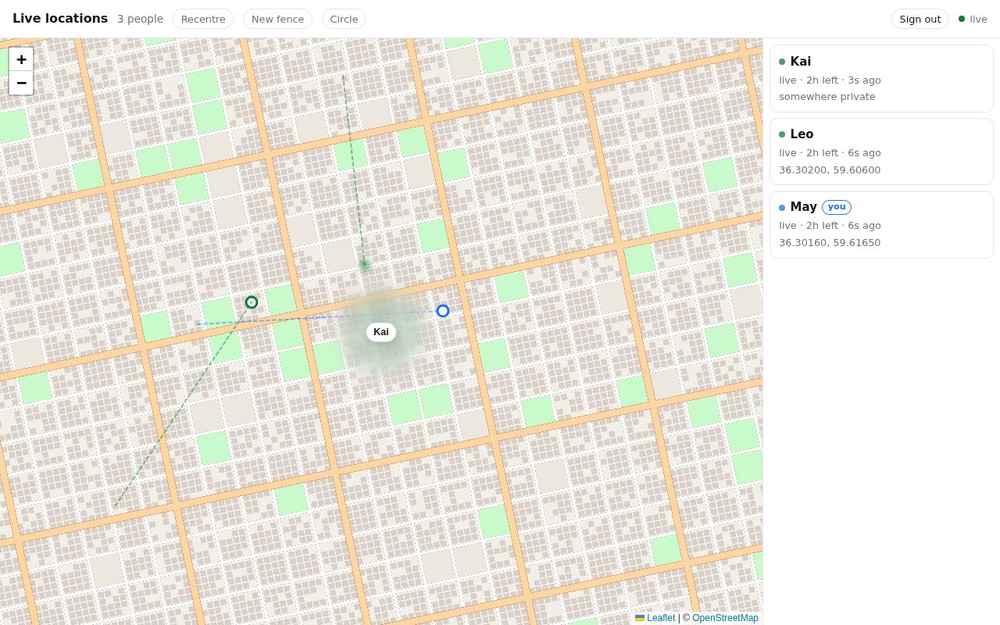

**Layout.** A header across the top, the map on the left, the list of people on the right (19rem wide).

At 760px or narrower, the list moves under the map (at most 38% of the screen height) and the header wraps onto two lines:

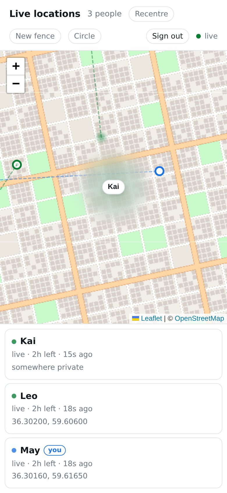

**Header**, left to right:

| Item | What it does | When it appears |
|---|---|---|
| **Live locations** | Page title. | Always. |
| `3 people` | How many are on the map. | When anyone is. |
| hint text | "Click the place to hide — Esc to stop". | Only while placing a private place. |
| **Recentre** | Fits the map to everyone. | When anyone is on the map. |
| **New fence** | Arms "click the map to place a fence". The label becomes "Click the map…" while armed. | When the database is on. |
| **Circle** | Opens the Circle panel (3.1.5). | When circles are on. |
| **Sign out** | Ends your session. | When you signed in as yourself. |
| ● `live` | Connection status. | Always. |

The connection status reads one of:
- `connecting…`
- `live`: green dot; updates stream in as they happen.
- `polling`: fallback; the page asks every 5 seconds.
- `reconnecting…`
- `offline`: grey dot.

The status is honest: if the stream silently stops, it switches within about 70 seconds.

#### 3.1.1 The list

One row (a `<button>`) per person, newest update first:

```
● Name   [you]
🆘 asked for help · until 11:39 AM         ← only during an SOS
stopped · live · 2h left · 6s ago           ← parts appear as they apply
Place name, or 36.30160, 59.61650, or "somewhere private"
```

- The dot:
  - green, pulsing: sharing live;
  - grey: not live;
  - blue: you; pale blue once you stop;
  - red, fast pulse: SOS.
- The list re-renders every second, so times count up.
- Hovering a row lights that person (3.1.3). Clicking pins them, zooms to them, and opens their card.
- With nobody on the map: "Nobody is sharing a location yet."

#### 3.1.2 On the map

The full vocabulary is in section 4. In brief:
- **Each person:** a dot, an accuracy halo, a dashed trail of their recent path, and a fan showing which way they're heading.
- **Inside a private place:** a soft breathing blur with their name on a chip, instead of a dot.
- **Fences:** faint purple shapes with a label.
- **Your own private places:** a lighter blur with a dashed purple edge.
- **Movement:** dots glide rather than jump.
- **The district name** (`#district`), bottom right: where the middle of the map is, the way a game names the district you drive into. It is the neighbourhood, quarter or suburb, or else the village, town or city. It appears from zoom 12 inwards and fades in again whenever the name changes.
  - A name in another script is followed by a Latin line in spaced orange capitals, for example **وادوتس / VADUZ**. The name is set in the system font, and the Latin line in Oswald.
  - The names are OpenStreetMap's place nodes, from `/api/district`. That uses the imported extract where there is one, and vector tiles from OpenFreeMap everywhere else, proxied by the server.
  - It never takes a click, and the panels cover it.

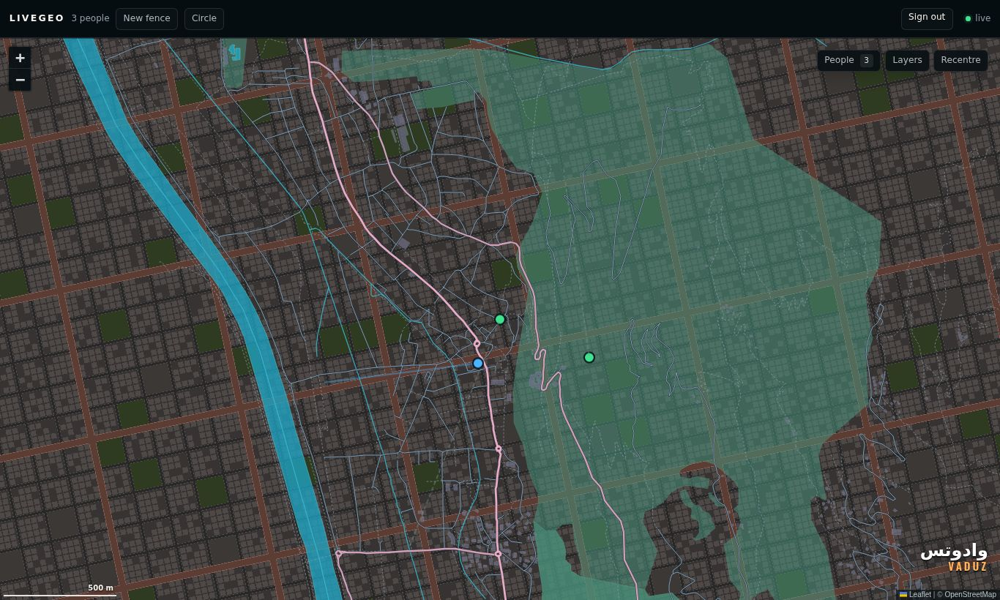

In this screenshot Vaduz was given a Persian name in the local copy, to show a name in another script with its Latin line. The map under it is the placeholder grid city, with the Liechtenstein extract's styled detail over it.

**The Layers panel** (**Layers** at the top right of the map):

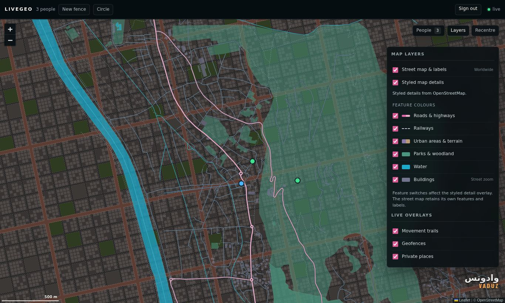

This was taken on the local copy with no extract imported, so the details come from vector tiles. The stand-in for OpenFreeMap built those tiles from the Liechtenstein extract, over the placeholder grid city.

- **Street map & labels:** the raster map underneath, worldwide.
- **Styled map details:** an overlay of real OpenStreetMap features in the map's own palette, from zoom 8. Six switches under **Feature colours** turn each one on or off: roads and highways, railways, urban areas and terrain, parks and woodland, water, and buildings (from street zoom).
  - The features come from the server's imported extract where there is one. Everywhere else they come from OpenFreeMap's vector tiles, fetched by the server. Either way they are drawn the same.
  - A status line under the switch says what is happening: "Styled details from OpenStreetMap.", "Zoom in for styled map details.", "Loading styled details…", "No styled features here…", "Styled details unavailable…", or "Styled details are off."
- **Live overlays:** movement trails, geofences and private places.

#### 3.1.3 Lighting a path (spotlight) and the time along it

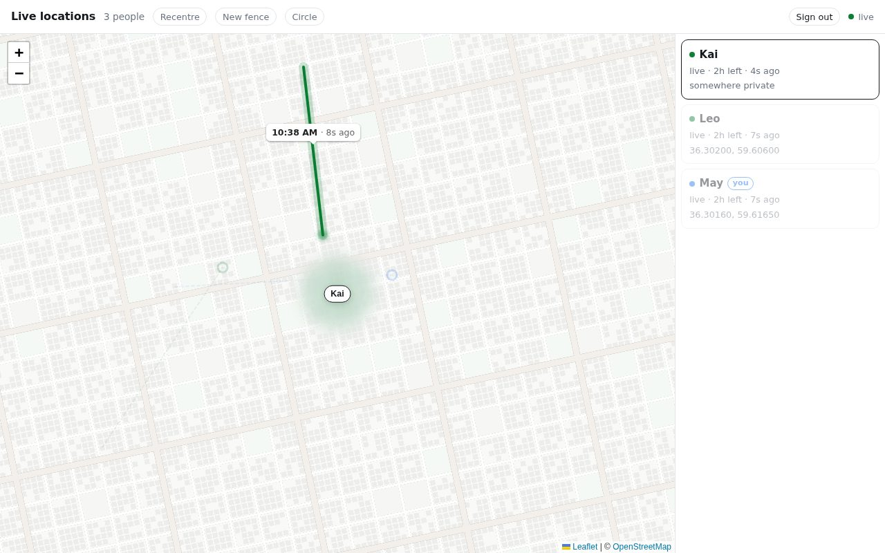

Hovering a person, their row, or near their path **lights** them:
- everyone else fades;
- the map goes grey;
- their path turns solid and thick, with a soft glow.

A **time label** follows the pointer along the path. It reads, for example, `10:38 AM · 8s ago · walking`. When the time is estimated between two readings it gets a `≈` prefix.

Clicking pins the spotlight; clicking empty map releases it. On touch screens, a tap does what hover does. Pinning someone also loads the last day of their path from history.

#### 3.1.4 A person's card (popup)

Clicking a dot, a name chip or a row opens a Leaflet popup:
- face: their Telegram photo, or their first initial;
- name, @handle, **numeric Telegram id**, and where they are.

**Your own card** carries most of the product's features:

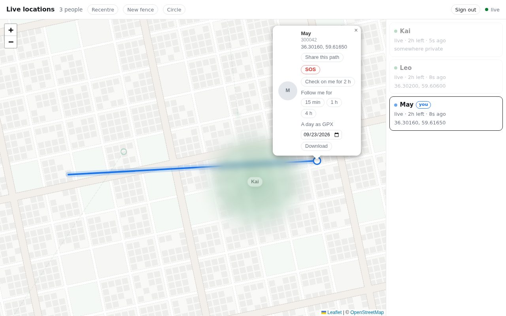

| Control | Shown to | What happens |
|---|---|---|
| **Share this path** | You on your own card; admins on anyone's | Makes a frozen, trimmed copy that anyone can open for 7 days. The card shows the link and "expires in 7 days". |
| **SOS** / **I'm safe** | You | See 6.5. A browser `confirm` comes first. |
| **Check on me for 2 h** / **Stop** | You | See 6.6. A browser `confirm` comes first. |
| **Follow me for 15 min / 1 h / 4 h** | You | Makes a live link. The card shows it with **Copy** and **Send…** (the phone's share sheet), plus what it allows and until when. |
| **A day as GPX…** | You; admins for anyone | Opens the GPX dialog (`#gpxDialog`). It shows the chosen day's path on a small map, with distance, times, readings and breaks. It offers **Download**, **Send…** (only where the phone can share files) and **Copy**, and "Show the file" reveals the file itself. It warns that the file is the exact path, private places included. Errors are written in the dialog, for example "Nothing was recorded that day." |

#### 3.1.5 The Circle panel

A popover under the header. It closes with Esc, a click outside it, or the Circle button.

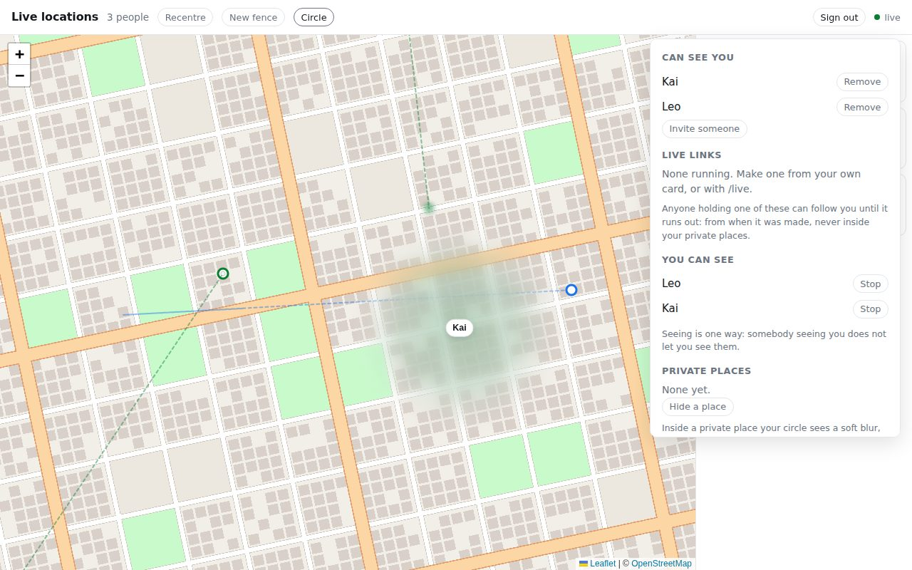

Sections, top to bottom:

1. **Can see you**: each person, with **Remove**. Then **Invite someone**, which shows a one-time link with **Copy** and "Works once, for a day…".
2. **Live links**: running links, each with **Copy** and **Stop**. SOS links are marked `SOS ·`. Only shown when live links are enabled.
3. **You can see**: each person, with **Stop**. Fine print: "Seeing is one way…".
4. **Private places**: your places (`Home · 500 m`), each with **Show** and **Remove**. Then **Hide a place**, plus fine print that ends "Admins still see everything."
5. **Watches**: paired watches, with **Remove**. Then **Pair a watch**, which shows a 6-digit code (`123 456`) valid for 5 minutes.

#### 3.1.6 Placing a fence, or hiding a place

This flow is entirely browser pop-ups today:

- **New fence:**
  1. Click the map.
  2. `prompt`: "What is this place called?"
  3. `prompt`: "How far across, in metres?" (default 150; allowed 25 m – 50 km).
  4. On a bad value, `alert`.
- **Hide a place** (from the Circle panel):
  1. The header hint appears.
  2. Click the map.
  3. `prompt`: "What is this place? Only you will see the name." (default "Home").
  4. `prompt` for the radius (200–5000 m, default 500).
- Nothing previews the circle before it is saved.
- Clicking an existing fence asks, with `confirm`, whether to remove it.

#### 3.1.7 SOS, as the people who can see you get it

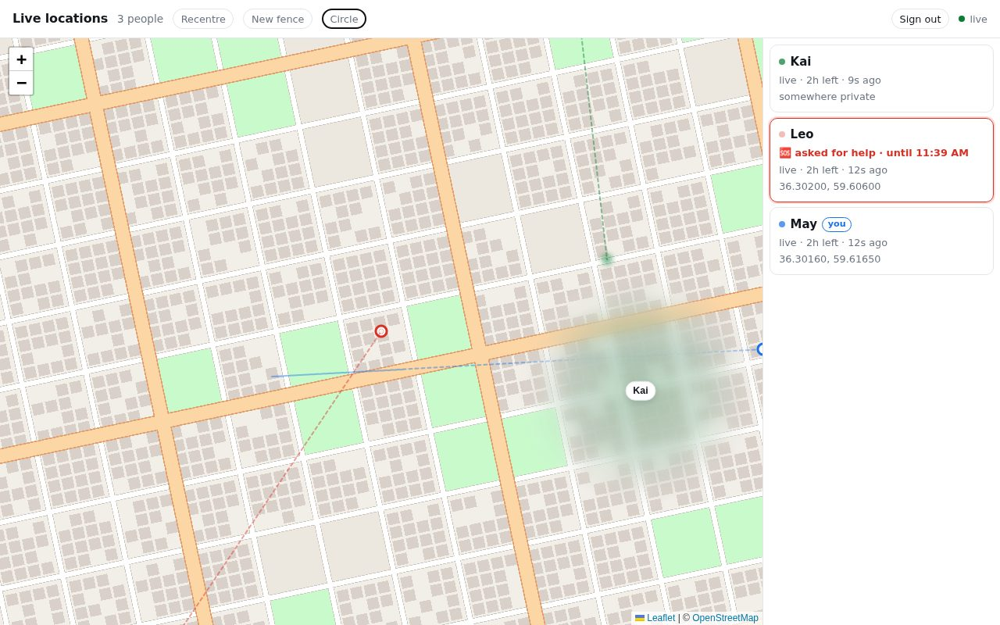

When someone in your circle raises an SOS:
- their row turns red, with `🆘 asked for help · until …`;
- their dot, trail and halo turn red;
- the map jumps to them **once**. It never jumps for your own SOS.

If they are inside a private place, their exact point now shows. Their trail stays hidden.

At the same moment the bot messages everyone who can see them, and adds a map pin (see 3.6).

#### 3.1.8 Dark theme

The dark theme follows the operating system. There is no switch.

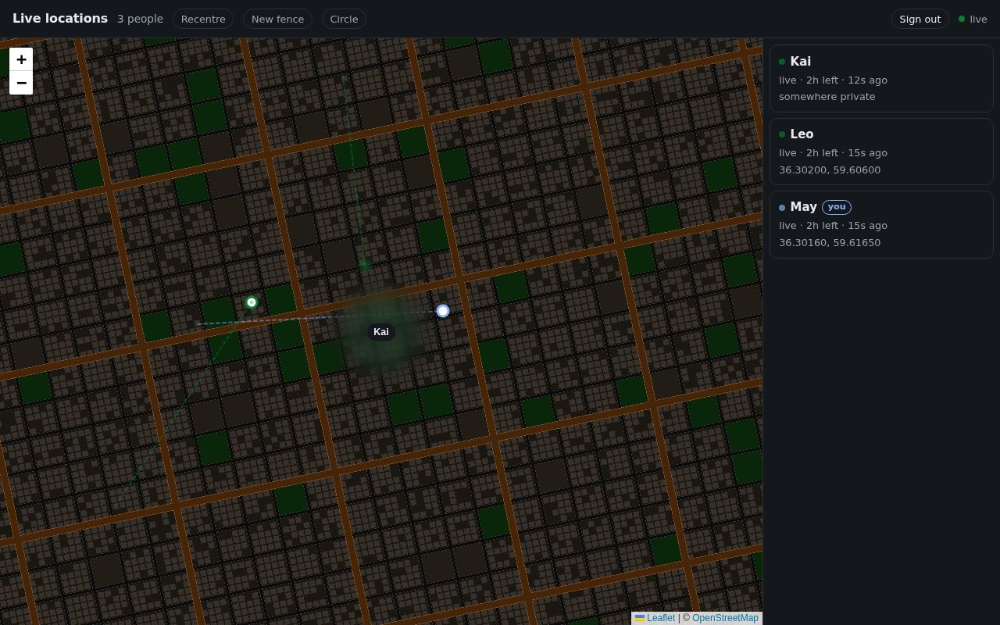

The map tiles are **inverted with a CSS filter**. There is no real dark map style. Your own blue is lighter in dark mode, so it stays readable.

### 3.2 The live-link page: `/live/<token>`

File: `public/live.html`. It opens without an account.

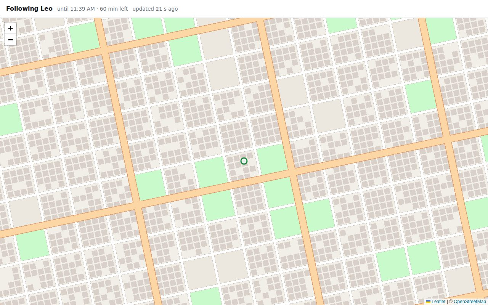

**Header:**
- title: `Following Leo`;
- how long is left: `until 11:39 AM · 60 min left`;
- status, one of:
  - `waiting for Leo's location…`
  - `updated 21 s ago · walking`
  - `somewhere private · 2 min ago`
  - `Leo stopped sharing their location · …`
  - `🆘 asked for help · …`, in red
  - `reconnecting…`

**Map behaviour:**
- The map keeps the person in view.
- Once you pan it yourself, it stops following, and a **Follow** button appears to resume.
- Only the path **since the link was made** is drawn. Leo's earlier path does not appear.

**When the link ends**, the map greys out and the person is removed:

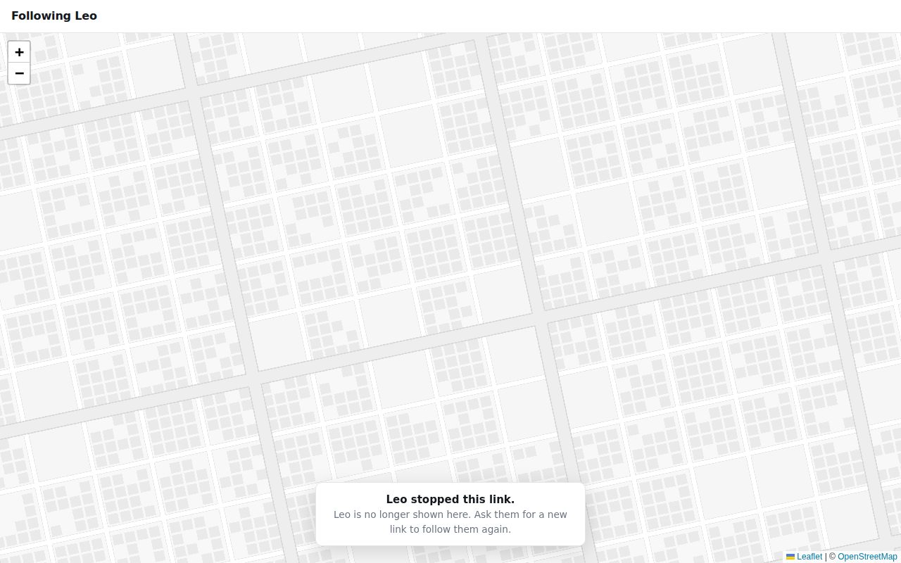

A notice explains which of three things happened:
- "This link has ended." (time ran out)
- "Leo stopped this link."
- "Leo is safe." (the link was an SOS)

A link that has already ended, or never existed, gets a small server page: "This link has ended".

### 3.3 The shared-path page: `/share/<token>`

File: `public/share.html`. It opens without an account.

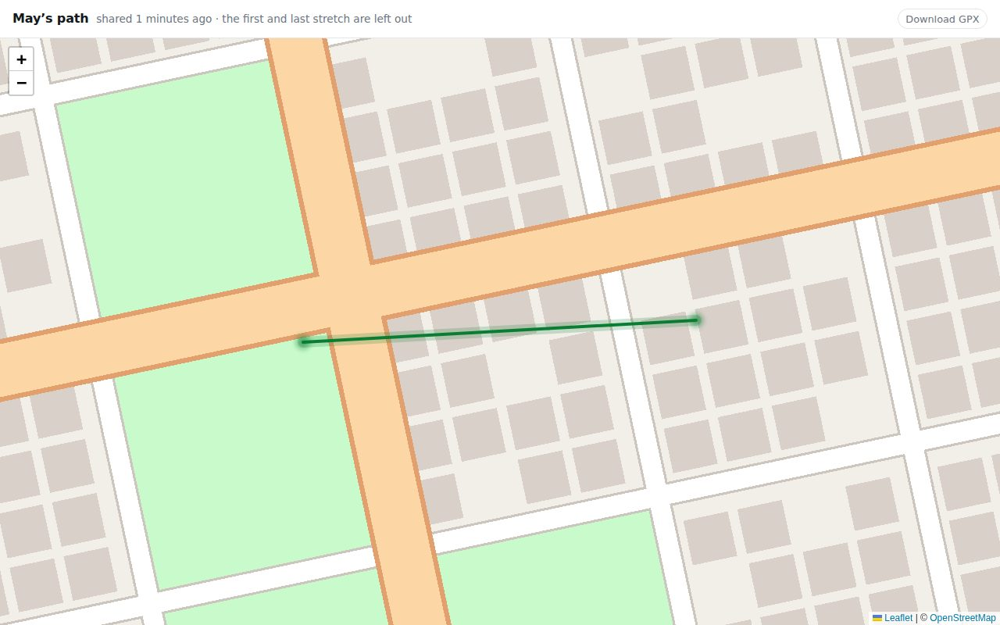

- **Header:** `May's path · shared 1 minutes ago · the first and last stretch are left out`, and **Download GPX**. ("1 minutes" is a bug: 10.8.)
- **The line:** always green, whoever it belongs to. It is a solid line with a glow.
- **The ends fade out**, and hovering an end explains why: "the path starts before here", "out of view", "back in view" and so on.
- **Hovering the line** shows the date and time at that point.
- **An expired or deleted link** replaces the whole page with a single grey sentence.

### 3.4 Sign-in: any page, when you aren't signed in

File: `public/login.html`. The server sends it (as a 401) in place of any page you aren't allowed into.

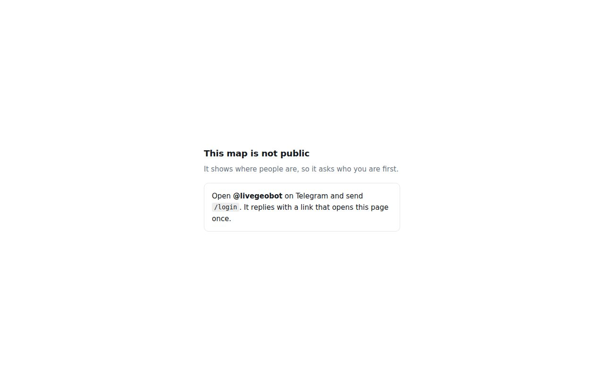

It offers up to three ways in; which appear depends on what the operator set up:
1. **Sign in with Telegram**: a blue button. Shown only if Telegram sign-in is configured.
2. **Telegram's own login widget**. This is the only thing on any page that loads from another site (`telegram.org`). Shown only if a domain is registered with BotFather.
3. **Always shown:** "Open @bot on Telegram and send /login. It replies with a link that opens this page once."

The live server uses only the third, today.

### 3.5 Pages the server writes itself

These pages are built in `src/server.js` by a tiny `page()` helper. They are unstyled apart from a system font, a narrow centred column and 3rem of space at the top.

| Page | When |
|---|---|
| **Signing you in…** + **Sign in** button | Opening a `/login` link. It submits itself at once. The button is for when JavaScript is off. This two-step exists because Telegram's link preview used to use up the one-time link. Keep it a form that submits (POST). 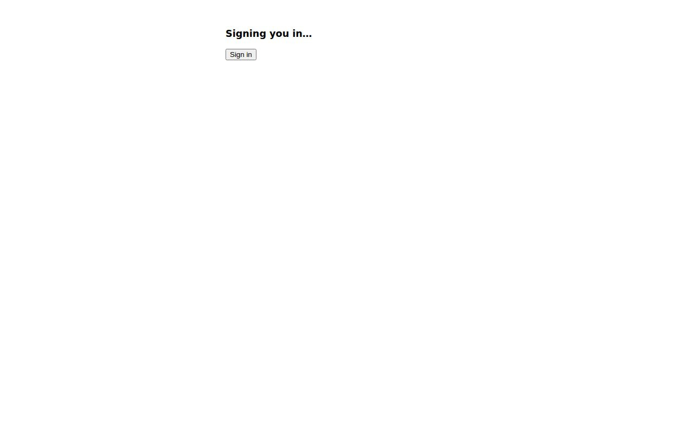 |
| **One more step, the first time** | The first "Sign in with Telegram" before your account is linked. Asks you to send `/login` and open that link in the same browser. |
| **Sign-in did not work** | "Sign in with Telegram" failed. The reason, plus "Try again". |
| **Telegram sign-in is unavailable** | Telegram couldn't be reached. |
| **This link has ended** | A live link that has ended, or never existed. |

**Refusals are plain text**, with no page at all (HTTP 403):
- "that link has been used already, or has expired — send /login again"
- "that account cannot sign in here"
- "that sign-in did not verify"
- "the login widget is not configured"

These are real dead ends people hit. See 10.6.

### 3.6 The Telegram bot

The bot is half the product's interface: sharing, signing in, invites and every alert happen in Telegram. Messages are plain text, with emoji as the only emphasis. `/circle` uses inline buttons.

- **`/start`**: a plain explanation of what is recorded and who can see it. This is the only place people being mapped are told, so it is deliberately direct rather than friendly.
- **`/help`** lists every command:
  - `/login`, `/invite`, `/live [15m|4h|stop]`;
  - `/sos`, `/safe`;
  - `/checkon [1h|4h]`, `/checkoff`, `/ok`;
  - `/circle`, `/pair`, `/stop`.
- **Replies** to each command, including errors in plain words. For example: "A live link lasts 15 minutes, an hour or four hours: /live 15m, /live, /live 4h."
- **The SOS message** to your circle:
  ```
  🆘 May asked for help.
  Where: near <place> (3 min ago)
  Follow them live for the next hour: <link>
  This came through livegeo, which has called nobody. If they may be in danger, call 110 (police) or 115 (ambulance).
  ```
  It is followed by a Telegram location pin. "I'm safe" sends "May is safe now…".
- **Check on me:**
  - It first asks you: "You have been stopped for 15 min near …. Are you all right? Send /ok — otherwise in 5 minutes I will tell the people who can see you where you are."
  - If you don't answer, it sends your circle a ⚠️ message that says "It may be nothing", again with the emergency number.
- **Fences:** "Leo arrived at Home", sent to the fence's owner.
- **Invites:** you are told who used your invite.
- **`/login`** replies with a link and "Opens once, and only for the next few minutes", with the preview turned off.

The exact strings are listed in the appendix (section 13).

### 3.7 The watch apps

- **Wear OS:** Jetpack Compose, in `watch/wearos/…/MainActivity.kt` and `TileMap.kt`.
- **Apple Watch:** SwiftUI, in `watch/apple/App/LivegeoApp.swift`.

Both have the same three screens:

1. **Pair**: type the 6-digit code from the map's Circle panel.
2. **Home**:
   - **Share for 1 hour**, **Share for 4 hours** and **Share until I stop**, or **Stop sharing** while sharing;
   - then the people you can see;
   - with nobody: "Nobody else yet. /invite in the bot adds people."
3. **Person**: a small map of one person. A green dot, or an area if they're somewhere private. With no position: "No position yet".

The watches hard-code the same green (`#0A7D33`) and don't know about "you" blue or SOS red yet. Their own workflow (`.github/workflows/watch.yml`) builds them.

---

## 4. The map's visual vocabulary

The dashboard now draws with MapLibre GL JS v6; Classic and the live/share
pages use Leaflet. Meanings and server privacy decisions are shared.

| Mark | Meaning and presentation | Rule |
|---|---|---|
| Self | Blue arrow with a current heading; disc otherwise; pale blue and Ⅱ when not live | SOS takes priority; self is above other ordinary points |
| Other person | Outlined green disc when live; grey disc and Ⅱ when not live | Focusable 44px button; state/name also in accessible text and card |
| SOS | Red diamond plus the word SOS | Never hidden behind buildings; confirmation and emergency-number disclosure remain |
| Halo / heading | Reported accuracy area and recent heading fan | Non-interactive; no heading for a private or stale person |
| Glide | A new authorised fix eases from the previous one | At most 1.2s; jumps over 2km and reduced-motion fixes do not glide |
| Trail | Dashed path; solid and glowing when selected | Separate runs across hidden stretches; faded ends without pins |
| Time label | Hover/tap a path in any camera | ≈ between recorded fixes; “time not recorded” for missing times |
| Private person | Still, soft ground polygon with a name chip at its rim | No point/centre marker; never a radar or edge blip; never a billboard |
| Private transition | Area fades in/out, point disappears/appears only as authorised | Reduced motion is immediate; no lingering last-seen pin |
| Your private place | Ground area, dashed purple rim, “Private · name” | Only the server-authorised owner data is drawn |
| Fence | Purple polygon and name below people/trails | Click/delete and placement/Esc flows retained |
| Spotlight | Others and the ground dim; selected trail lights | Empty-map click clears; people remain above buildings |
| Mountain relief | Stepped green-to-tan elevation tint and shaded ridges from real DEM tiles | Flat cartographic shading; no terrain mesh moves people or privacy areas |
| Buildings | Flat footprints by default; optional 3D roof highlights and night windows | Heights are illustrative; tags then stable type defaults |
| Radar | Flat heading-up map around self or a spotlight point; edge-clamped points | Hidden without a point centre; private people omitted; no extra tile stream |

The collapsed legend sits below cards. On a 390px phone it opens in reserved
space below a resized map, not over the map. District text describes the
rounded/debounced view centre; a centre inside a privacy area says “Private
area” without a place lookup.
Below zoom 8, areas, trails and ground labels are suppressed; private people
remain listed in People and a non-geographic area-count HUD. This prevents
subpixel veils or their name chips from reading as precise world-scale pins.

## 5. The visual language today (dashboard)

`public/lib/game-map.css` defines the dashboard HUD; shared Leaflet files and
other pages keep their existing appearance. The original reference now guides
the dashboard: a flat map with title/key at left, controls and compass at right,
and a small optional radar. Teal panels have thin cyan borders and pink accents.
Latin headings use Barlow Condensed; body/Persian text uses Vazirmatn without spacing.

| Token | Dashboard value | Role |
|---|---|---|
| `--ink` / `--paper` | `#edf6f3` / `#0a1720` | Text / panel ground |
| `--quiet` | `#b4c7cd` | Secondary text |
| `--accent` | `#ffd68a` | Controls, headings and focus |
| `--me` / `--me-stale` | `#5bc5ff` / `#b4d4ec` | Self states |
| `--live` / `--stale` | `#62efae` / `#b6c5ca` | Other states |
| `--danger` | `#ff6b78` | SOS only; pale red text on dark backing |
| `--place` | `#b2a1ff` | Private places/fences |

State marks have contrasting pale and dark outlines. Red/red-orange ground
is reserved for SOS; purple ground for places. Sky/HUD may be warm or violet.
Road hierarchy uses pale pink/magenta, cyan water, green parks/woodland and
muted blue/periwinkle urban fills; purple ground remains reserved for private places/fences.
Day is the default. Pin Golden hour / Night or follow locally computed solar
elevation. Lighting checks run at three-minute intervals.

Map is the default: flat, north-up, Mercator. Optional 3D · auto switches
from globe to a city with at most 58 degrees of automatic tilt. Chase requires a visible sharing self, uses heading-up, and becomes
north-up when heading is unknown. Lite removes sky, extrusion and road glow.
Camera changes are immediate under reduced motion; ordinary transitions are
short and finite. Mountain relief uses a stepped elevation ramp beneath land use,
parks, water and roads, plus directional hillshade. Lite disables it. No
continuous decorative animation or idle map repaint loop.
Phone pixel ratio is capped at 1.5, antialiasing is off, and the radar initially
defaults off on narrow screens. See [demo measurements](game-map/README.md)
for the software-rendering stress result and the physical-device follow-up.

---

## 6. Flows

How each feature works today. Wording in quotes is the actual copy.

### 6.1 Getting onto the map

1. In Telegram, open the bot and press **Start**. It explains what it records.
2. Share: 📎 → Location → **Share My Live Location**, and choose a duration. Telegram ends it on its own.
3. To see the map, send `/login`. The bot replies with a one-time link valid for **5 minutes**.
4. Tap the link. "Signing you in…" appears briefly, then the map opens. You stay signed in for 30 days.

A one-off "Send this location" appears on the map too, but never as live.

### 6.2 Letting someone see you

1. Get an invite from `/invite` in the bot, or **Circle → Invite someone** on the map.
2. The other person taps it (a Telegram deep link). It works once, within a day.
3. You're told who used it.
4. To undo: **Circle → Can see you → Remove**, or `/circle` in the bot.

### 6.3 Follow me (live link)

1. On your own card: **Follow me for 15 min / 1 h / 4 h**. Or `/live`, `/live 15m`, `/live 4h`.
2. Send the link to anyone. It needs no Telegram and no sign-in.
3. They see you from **now** until it ends, never inside your private places.
4. To stop: **Circle → Live links → Stop**, or `/live stop`. At most 5 can run at once.

### 6.4 Private places

1. **Circle → Hide a place**, click the map, name it, and give a radius of 200 m – 5 km. You can have up to 10.
2. Inside it, your circle sees a blur somewhere around the place, not centred on it, and paths you share leave that stretch out.
3. Admins still see you exactly. The fine print says so.

### 6.5 SOS

1. On your own card, press **SOS**. Or send `/sos` in the bot.
2. A browser `confirm` asks: "Send your exact location to everyone who can see you, and let them follow you for an hour — even inside your private places? This calls nobody. If you are in danger, call the emergency services."
3. What happens:
   - everyone who can see you gets the bot message and a pin;
   - an hour-long live link is made;
   - your exact point shows even inside private places. Your trail stays hidden.
4. An `alert` reports how many people were told, and repeats the emergency number.
5. Pressing SOS again within 30 seconds sends nothing new.
6. **I'm safe** on your card, or `/safe`, ends it, and everyone is told. If it runs out after an hour, the bot asks whether you still need help.

### 6.6 Check on me

1. On your own card, press **Check on me for 2 h**. Or `/checkon`, `/checkon 1h`, `/checkon 4h`.
2. A `confirm` explains the rule: if you stop for 15 minutes somewhere that isn't one of your places, or your live location stops, the bot asks whether you're all right.
3. You answer `/ok`. If you don't within 5 minutes, your circle is told where you are, with "It may be nothing" and the emergency number.
4. It never lifts your private places.

### 6.7 Fences

1. Press **New fence**, click the map, name it, and give a radius of 25 m – 50 km.
2. When someone you can see arrives or leaves, the bot tells you: "Leo arrived at Home".
3. Inside a private place, a crossing is only reported to people who can see that person exactly.
4. Click a fence to remove it.

### 6.8 Sharing a path, and GPX

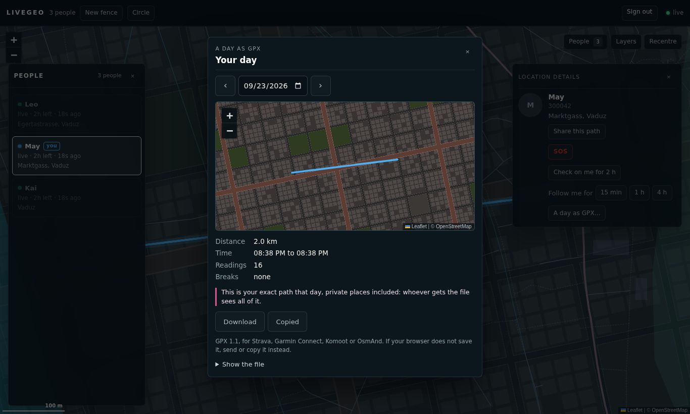

- **Share this path** makes a frozen copy that anyone can open for 7 days. Its first and last 200–500 m are cut at random, so neither end marks a door.
- **A day as GPX…** opens a dialog showing the day before anything is saved: its path on a map, and how far and how long. From there it is downloaded for Strava, Garmin and similar apps, sent to another app, or copied. A download alone can silently fail in a phone's in-app browser.

### 6.9 Watches

1. **Circle → Pair a watch** shows a code valid for 5 minutes.
2. Type it on the watch. The watch then shows your circle and can share its own location as you.

### 6.10 Leaving

`/stop` in the bot does three things:
- takes you off the map;
- deletes the path held about you;
- tells every open map.

---

## 7. Rules the design must not break

These are product decisions about privacy and safety. Changing one is a conversation with the product owner and engineering, not a visual tweak.

**7.1 The server decides what each person may see. The page only draws it.**
- For someone inside a private place, the server sends only an area, not the point. There is nothing more exact in the browser to reveal.
- Never design something that implies more precision than exists. No "last seen here" pin, no centre dot, no estimated position inside a blur.

**7.2 The blur is deliberately not centred on the hidden place.**
- The server moves its centre at random, up to half the radius, so the middle of the blur doesn't point at someone's door.
- Don't add a crosshair, a centre mark, or anything else that invites people to treat the middle as the spot.

**7.3 Shared paths and live links lie about nothing and reveal nothing extra.**
- A shared path is trimmed at both ends, and the page says so.
- Its ends fade out. They are not start and finish pins.
- A live link shows only what happened after it was made.

**7.4 SOS and check-on-me never pretend to be emergency services.**
- Every SOS and check-on-me message, confirm box and result says that livegeo **called nobody**, and gives the number to call (`SOS_CALL`, default "110 (police) or 115 (ambulance)").
- Keep that sentence visible in any redesign. Keep a confirmation step before an SOS goes out.
- A redesign can make SOS **easier** to reach (please do: 10.2). It must still be hard to trigger by accident.

**7.5 Red means someone asked for help.**
- Don't use red for errors, deletes, or "offline".
- The SOS red also beats every other state colour, including your own blue.

**7.6 Honest about time and certainty.**
- "Exact at a reading, ≈ between two." "time not recorded" when there is none.
- The connection indicator must not say `live` over a map that has stopped updating.

**7.7 Consent is spelled out.**
- Seeing is one-way.
- Invites work once, for a day, and you're told who used one.
- Admins see everything, and the private-places fine print says so. Any redesign of that panel must keep that disclosure.

**7.8 The bot's welcome message is the disclosure.**
- `/start` is where people being mapped learn what is recorded.
- Rewrite it if you like, but it must still say:
  - that the path is kept;
  - who can see it;
  - how to stop and delete it.

**7.9 No tracking of the people using it.**
- No analytics, no third-party scripts, no tracking pixels. That covers "just a font" and "just an icon CDN" too (section 8).

---

## 8. Technical constraints and warnings

### 8.1 How the front end is built

- Plain HTML, no framework or application build step.
- `public/index.html`: ES5-style panel/API/privacy logic, unchanged selectors.
- `public/lib/map-bootstrap.js`: ES5 feature detection and remembered Classic choice.
- `game-start.mjs`, `game-map.mjs`, `game-style.mjs`: lazy ESM MapLibre v6 renderer,
  drawing adapter, solar calculation and styles. WebGL2 is required.
- The adapter supports the same people, trails, veils, fences and placement
  interactions. SVG overlays project ground geometry at the current pitch,
  while HTML blips and names remain above buildings.
- `people-map.js/.css` remain unchanged for Classic and `live.html`;
  `path-time.js` supplies the common path/time/heading math.
- Startup/GPU failure, absent module/WebGL2 support or selecting Classic
  starts the complete Leaflet dashboard. The renderer choice is per-browser.
- The import-free `src/tile-path.js` remains compatible with the Worker.
  Static `.mjs`, `.pbf`, `.woff2`, `.json`, `.wasm` types are explicit and tested.

### 8.2 No resource may load from another site

MapLibre 6.11.1 (BSD-3), the RTL plugin (BSD-2 + ICU), OFL Barlow/Vazirmatn
fonts and glyphs, and public-domain Natural Earth land are vendored with
licences. `/lib/map-assets/` resolves within that vendor directory, with
ETag revalidation, so the app deploy also updates assets through an existing
Worker. There are no third-party browser runtime resources. Source links and exact
regeneration commands: [`public/vendor/README.md`](../public/vendor/README.md).
Run `npm ci && npm run glyphs` to regenerate committed glyph PBFs, including
Arabic presentation forms. Real “مشهد” and “تهران” shaping is browser-tested.

Natural Earth 1:110m provides global land/coastline, including outside the
regional import. Local authenticated `/carto/z/x/y.mvt` tiles use `ST_AsMVT`,
4096 extent, 192 buffer, independent feature budgets and bounded/coalesced
caching. Empty local tiles fall back to the configured/cached worldwide
OpenMapTiles source via `src/world-vector.js`, retaining bounds, holes and
layer/feature limits while overzooming from source zoom 14. Selected world POIs
use original neutral icons; medical facilities never use SOS red. Gzip is
negotiated; unavailable tiles remain valid empty MVT. SVG tiles
stay available to Classic. Raster `/tiles/` is off by default in WebGL. Classic keeps its worldwide
server-side vector-to-SVG fallback and district-name service. The GPX dialog
keeps a separate Leaflet preview, including when the dashboard uses WebGL.
The existing sign-in widget exception in §8.2 remains outside this dashboard.

`/relief/z/x/y.png` serves cached 256px Mapzen Terrarium DEMs, capped at source
zoom 12, through the same dashboard authentication. `TERRAIN_UPSTREAM=off`
disables them; the client reads `/api/map-config`. The cache enforces PNG/size
validation, an 8-second timeout, coalescing, minute-long failure backoff, stale
fallback, 64 in-memory tiles and periodic disk pruning to 128 MiB / 768 tiles.
Credits for each provider are available via the on-map terrain link. Relief
is drawn by color-relief/hillshade layers, never `setTerrain()`, preserving the
projection and privacy/occlusion rules for overlays. Local POI nodes and world
vector POIs add neutral original landmarks; red stays reserved for SOS.

Road text is symbol-placed along lines; district/place symbols collide rather
than overlap. Labels are strings to the renderer, never injected HTML. Any
name crossing into a DOM tooltip/chip/card must still go through `esc()`.

### 8.3 Things that break silently if renamed

- **The GPX dialog:** `gpxDialog` and the ids inside it (`gpxTitle`, `gpxClose`, `gpxPrev`, `gpxDate`, `gpxNext`, `gpxMap`, `gpxStatus`, `gpxFacts`, `gpxWarning`, `gpxSave`, `gpxSend`, `gpxCopy`, `gpxFile`, `gpxText`). The card's button keeps the `gpxbtn` class.
- **The district name:** `district`, the box in the map's bottom-right corner, filled from `/api/district`, and its `show` class.
- **The Layers panel:** `layersbtn`, `layersPanel`, `cartographyStatus`, and the `data-layer` and `data-feature` attributes on its checkboxes. The feature names (`roads`, `rail`, `landuse`, `parks`, `water`, `buildings`) are what the server's `/carto/…?layers=` accepts.
- **Element ids the scripts look up.**
  - Dashboard: `map`, `list`, `count`, `hint`, `recentre`, `newfence`, `circlebtn`, `signout`, `conn`, `circle`, and ids inside the Circle panel (`mkinvite`, `invitebox`, `livelist`, `zonelist`, `mkzone`, `devices`, `mkcode`, `codebox`, `copyinvite`).
  - Dashboard panels/layers: `layersbtn`, `layersPanel`, `peoplebtn`, `peoplebadge`, `peoplePanel`, `peopleclose`, `panelcount`, `detailPanel`, `detailclose`, `cartographyStatus`, `cartographyFeatures`, `data-layer`, `data-feature`.
  - Live page: `who`, `when`, `state`, `follow`, `notice`.
  - Share page: `who`, `when`, `gpx`.
  - Sign-in: `oidc`, `widget`, `or`, `bot`.
- **Classes that carry behaviour.**
  - List rows: `person`, `live`, `sos`, `me`, `lit`.
  - Body state: `spotlight` and `fencing` on `<body>`, `over` on the live page.
  - Buttons: `share`, `gpxbtn`, `livebtn`, `sosbtn`, `safebtn`, `checkbtn`, `uncheckbtn`, `copylink`, `sendlink`, and the `data-*` attributes on Circle-panel buttons.
  - Blur classes in `people-map.css`: `veil`, `fog`, `in`, `out`, `dim`, `huge`, `mine`, `veil-chip`, `puff`, `beam`.
- **The sign-in page's `<body>` tag must stay exactly `<body>`.** The server finds that literal text and inserts the bot's name into it. `<body class="…">` would break the sign-in page.
- **Colours handed to the map drawing code must be 6-digit hex** (`#1a73e8`), not `rgb()`, names or 3-digit hex. The code mixes them into transparent tints.
- **"Signing you in…" must stay a form that submits (POST).** A plain link, or an automatic redirect, lets Telegram's link preview use up the one-time link again.

### 8.4 Escaping

- Names, @handles, fence names, place names and private-place names are all typed by people.
- Anything built as HTML must escape them with the page's `esc()`. Leaflet tooltips and popups count as HTML.
- A person's name ran as script on other people's maps until this was fixed on 23 September (commit `99da2e7`). Keep it fixed.

### 8.5 Operational warnings

- **Pushing to `main` deploys to the live server within about a minute.** Real people's locations are on it. Work on a branch; merge after review.
- **Don't put production screenshots, addresses or tokens** into design files, tickets or chats. The dashboard token and the tunnel address are secrets. Use the demo setup (12.2).
- **Links die when the server restarts.** Every deploy wipes `/login` links. A tunnel restart kills live and SOS links already sent. This is known; it isn't a design bug to chase.
- **Features depend on the database.** Without PostgreSQL/PostGIS, circles, fences, private places, live links, SOS, check-on-me, history, sharing and GPX are all switched off, and their buttons hide themselves. Design the empty and absent states too.

---

## 9. Accessibility: where it stands

### 9.1 Contrast

WCAG 2.2: 4.5:1 for normal text, 3:1 for large text, icons and borders.

| Pair | Ratio | Verdict |
|---|---|---|
| `--quiet` on white (secondary text) | 4.74 | passes, barely |
| `--quiet` dark on dark paper | 6.97 | passes |
| `--me` blue on white (the "you" tag) | 4.51 | passes, barely |
| `--me` dark on dark paper | 8.46 | passes |
| SOS red on white (alarm text) | 4.77 | passes |
| **SOS red on dark paper** (alarm text) | **3.73** | **fails** for its size (.8rem bold) |
| `--live` green on white | 5.26 | passes |
| `--live` green on dark paper (list dot) | 3.39 | passes as a graphic |
| Not-live map dot `#8a929b` on white | 3.15 | passes as a graphic, barely |
| **`--stale` list dot `#9aa3ad` on white** | **2.56** | **fails** (graphic, needs 3:1) |
| `--me-stale` on white | 3.29 | passes as a graphic |
| **White on Telegram blue** (sign-in button) | **2.57** | **fails** |
| **`--hairline` borders on white** (inputs, buttons) | **1.25** | **fails** for input borders (3:1) |
| Fence labels | n/a | grey .72rem text straight on the map, with no backing; hard to read on busy tiles and in dark mode |

### 9.2 Other gaps

- **Colour alone carries state on the map.** Green, grey, blue and red dots differ only by colour. The list adds words ("live", "you", "asked for help"); the map doesn't.
- **The map can't be used from a keyboard.**
  - Dots and paths aren't focusable.
  - The list rows are buttons, so the list is the keyboard route. Keep it complete.
  - Leaflet's own zoom buttons work.
- **Screen readers.**
  - Nothing announces an arriving SOS. The only `aria-live` region is the district name (`polite`), which is read out when it changes as the map moves. If that proves chatty, it is one attribute.
  - The Circle panel has no dialog semantics or focus handling, and the Circle button has no `aria-expanded`.
  - Popups aren't announced.
- **Touch targets** are about 24px tall (ghost buttons) and 14–18px (dots). The usual guidance is 44px.
- **Focus styles** are the browser defaults.
- **Hover-only information** has tap equivalents: tapping a path shows its time, tapping a dot opens the card.
- **Motion:** reduced motion is respected everywhere (5.4).
- **Language:** `lang="en"` everywhere. There is no RTL support at all (10.1).

---

## 10. Known problems and opportunities

Ordered by how much I think they matter. **P1** is important; **P3** is polish.

### 10.1 P1: Persian, right-to-left, local formats

**The problem:**
- Everything is in English.
- The defaults point at Iran: the map opens on Tehran, and the emergency numbers are 110 and 115.
- Dates and times follow the browser's locale, via `toLocaleTimeString`, so formatting varies by device.
- The GPX dialog's date picker is Gregorian.

**What a design needs to decide:**
- which languages;
- an RTL layout (the list and panels mirror; the map does not);
- Persian or Latin digits;
- Jalali dates;
- a font that covers Persian and is self-hosted (8.2).

The bot's messages need translating too (section 13).

### 10.2 P1: SOS is hard to find

**The problem:** to raise an SOS on the map, you must:
1. find your own row or dot;
2. open your card;
3. press a small ghost button among five others;
4. accept a browser `confirm`.

In the bot it's `/sos`, which is easier but only if you remember it.

**The opportunity:** a persistent, clearly labelled entry point, for example in the header or as a floating action button. It must still be hard to trigger by accident (a hold-to-confirm, or a two-step sheet), must keep the "calls nobody" wording (7.4), and must make the running SOS state and **I'm safe** equally obvious.

### 10.3 P1: Browser pop-ups for important moments

**The problem:**
- SOS and check-on-me confirmation, fence and private-place creation (two `prompt`s each), fence removal and many errors all use `window.confirm`, `prompt` and `alert`.
- They look different in every browser.
- They can't be styled or translated beyond their text.
- **They may not appear at all in some in-app browsers**, such as the one Telegram opens links in. That needs checking on real phones, because an SOS that silently can't be confirmed is serious.

**What's needed:** designed dialogs and sheets, including a map-based way to place fences and private places, with the circle previewed before saving.

### 10.4 P2: Nothing explains the map

**The problem:** there is no legend. The meanings in section 4 have to be guessed:
- blue, green, grey, red and purple;
- the blur;
- the fan;
- fade-ends;
- `≈`.

**What would help:** a small, dismissible legend or help sheet. It also belongs in the empty state.

### 10.5 P2: Phones

**The problem:**
- The header wraps onto two lines (see `07-phone`).
- Buttons are small (9.2).
- The list is squeezed under the map.
- The card is a tall Leaflet popup that can cover the person it belongs to.
- The Circle panel is a floating box.

**What would help:** a bottom-sheet pattern for the list, the card and Circle on narrow screens.

### 10.6 P2: Dead-end errors

**The problem:**
- The refusals in 3.5 are bare plain text: "that link has been used already, or has expired — send /login again".
- The server's own pages are unstyled.
- Being turned away is a moment that needs a friendly way forward: what happened, what to do, and a link to the bot.

### 10.7 P2: The card and the list compete

**The problem:**
- Your own card holds five unrelated tools: share path, SOS, check on me, follow me, GPX.
- Other people's cards show a **numeric Telegram id**. That's rarely useful, and arguably shouldn't be shown at all (question in section 11).
- The list row and the card repeat the same facts.

**What would help:**
- rethink the information architecture: *people*, *me*, *safety*, *places*, *settings*;
- give "me" a home of its own, rather than a popup on a dot.

### 10.8 P3: Copy and formatting bugs found while writing this

- The shared-path page says **"shared 1 minutes ago"**. Plurals are wrong below two minutes (`share.html`, `ago()`).
- **Time units differ between pages:** "6s ago" and "2h left" on the map; "21 s ago" and "60 min left" on the live page; "3 minutes ago" on the shared-path page.
- The GPX dialog's date field shows the browser's format (`09/23/2026` on an American English browser).
- Coordinates (`36.30160, 59.61650`) are shown when no place name is known. They are useful, but noisy as the main line.

### 10.9 P3: Dark theme

**The problem:**
- The map is the light map inverted by a filter. Colours shift, and the blur's tint nearly vanishes (see `06-dashboard-dark`).
- Fence labels sit on the map with no backing.

A real dark map needs a dark tile source (5.5).

### 10.10 P3: Design tokens are copied, not shared

**The problem:**
- Each page redefines `:root` itself.
- The live and shared-path pages lack `--me`, `--stale` and others.
- SOS red, place purple, the grey map dot and the white dot fill are hard-coded in scripts.

**What's needed:** a single `public/lib/tokens.css`, plus reading those tokens from JavaScript. That makes any new palette a one-file change. It's small engineering work, worth doing before a visual redesign lands.

### 10.11 P3: Smaller things

- **No sound or banner** when someone raises an SOS while you're looking at the map; only the jump and the red row.
- **The empty state** ("Nobody is sharing a location yet.") doesn't say how to start sharing.
- **Only one control is labelled**: `New fence` changes to `Click the map…` while armed. Hide-a-place gives only the header hint.
- **The Circle panel is long**, with five sections, and scrolls inside a box.
- **The Telegram photo** is only fetched when a card opens. Rows have no avatars.
- **The watches** use green for everyone, with no "you" blue and no SOS red (3.7).

---

## 11. Questions for the product owner

1. **Name and identity.** "livegeo", "Live locations" or something else? Is there a logo? Page titles, the bot and the watches each use a different name today.
2. **Languages.** Persian only, English only, or both with a switch? Which digits, and which calendar?
3. **Audience.** Families? Friends? Small teams? Tone and features differ: a family app might want roles like "parent".
4. **SOS numbers.** Are 110 and 115 right for every user? Should the number follow where the person is?
5. **Telegram ids on cards.** Keep them, hide them, or show them only to admins?
6. **Admins.** How visible should the fact be that admins see everyone exactly? Today it's one line of fine print in the Circle panel and one line in the bot's welcome.
7. **The watches.** Are they in scope for this redesign?
8. **Sign-in.** Is "Sign in with Telegram" (a button, with a domain registered) going to be turned on? It changes the sign-in page a lot.

---

## 12. Working with engineering

### 12.1 Where things are

| What | File |
|---|---|
| The map (all of it: styles, markup, behaviour) | `public/index.html` |
| Live-link page | `public/live.html` |
| Shared-path page | `public/share.html` |
| Sign-in page | `public/login.html` |
| How a person is drawn (dot, blur, glide, fan) | `public/lib/people-map.js`, `public/lib/people-map.css` |
| Path and time maths (gaps, `≈`, speeds like "walking") | `public/lib/path-time.js` |
| Server-written pages and plain-text refusals | `src/server.js` (`page()`, `refuse()`) |
| Bot copy: welcome, help, replies | `src/bot.js` |
| SOS message | `src/sos.js` (`sosMessage`) |
| Check-on-me messages | `src/checks.js` (`checkAsk`, `checkTell`) |
| Fence arrival message | `src/fences.js` (`announce`) |
| `/login` answers | `src/index.js` (`onLogin`) |
| Wear OS app | `watch/wearos/app/src/main/kotlin/org/livegeo/watch/` |
| Apple Watch app | `watch/apple/App/` |
| Operator documentation | `README.md` |

### 12.2 Seeing it on your own computer

You need Node 20 or newer and a Telegram bot of your own for testing. Get one from @BotFather in two minutes, and **never** use the production bot.

```sh
npm install
BOT_TOKEN=<your test bot's token> \
DASHBOARD_USERS=<your own Telegram id> \
PUBLIC_URL=http://localhost:8080 \
npm start
```

Then:
1. Send `/login` to your test bot and open the link.
2. Share a live location to the bot from your phone to appear on the map.

(@userinfobot tells you your Telegram id.)

Circles, private places, live links, SOS, fences and history need PostgreSQL with PostGIS. `bin/setup-postgis.sh`, the compose file, and "Setting it up" in `README.md` cover that. It's easiest to ask engineering for a running demo.

**Limitation.** There is no built-in demo mode with made-up people. The screenshots here came from a throwaway local setup: a fake Telegram, placeholder tiles and scripted walkers. Worth adding properly, so design work never needs real data. Ask engineering; `TELEGRAM_API` and `TILE_UPSTREAM` already let the app point at stand-ins.

### 12.3 What to hand back

- **Tokens** for light and dark: colour, type scale, spacing, radius, elevation and motion durations, named by what they mean (`--sos`, `--place`, `--me`), not by hue.
- **Every state** of every component. Section 3 and section 4 list them; missing states are where implementations guess. For a person, that means:
  - live; not live; stopped; no position yet;
  - inside a private place; SOS;
  - you;
  - lit or dimmed.

  Plus: loading, empty, error, offline, reconnecting, and features switched off.
- **Phone (390px) and desktop (1280px) layouts.** RTL mirrors, if Persian is in scope.
- **A copy deck** with every string, in every language, including the bot's messages. Use section 13 as the checklist.
- **Assets:** SVG icons, and font files with their licence.
- **Motion specs** with the reduced-motion alternative for each.

### 12.4 A checklist for any design change

- [ ] Works in light and dark.
- [ ] Works at 390px wide, and RTL if Persian is in scope.
- [ ] Every animation has a reduced-motion version.
- [ ] Text contrast is at least 4.5:1; icons and borders at least 3:1.
- [ ] Nothing is conveyed by colour alone.
- [ ] Reachable and usable with a keyboard, and with a screen reader where it matters (SOS above all).
- [ ] Touch targets at least 44px on phones.
- [ ] Nothing loads from another site.
- [ ] Nothing shows more precision than the server sent (7.1–7.3).
- [ ] SOS copy still says it calls nobody, with the number (7.4).
- [ ] Red is still only SOS (7.5).

### 12.5 Tests

- `npm test` runs about 650 server-side checks.
- There are no automated visual or browser tests. UI changes so far were checked by hand in a real browser (Playwright).
- A set of screenshot tests would protect the redesign; worth planning with engineering.

---

## 13. Appendix: where every piece of copy lives

| Copy | Location |
|---|---|
| Map: header, list rows, card, Circle panel, confirms, alerts, prompts, empty states, connection status | `public/index.html` (search for `'` strings in the script and the `<header>` markup) |
| Live-link page: header lines, "ended" notices, "somewhere private" chip | `public/live.html` (`status()`, `end()`) |
| Shared-path page: header, fade-end tooltips, "expired" line | `public/share.html` |
| Sign-in page | `public/login.html` |
| Server pages: "Signing you in…", "One more step…", "Sign-in did not work", "This link has ended"; refusals | `src/server.js` |
| Bot welcome and help | `src/bot.js`, `WELCOME` and `HELP` near the top |
| Bot replies to each command | `src/bot.js`, the command handlers (search `say(command.chat,`) |
| Invite, `/circle` text and buttons | `src/bot.js` (circle helpers) |
| `/login` replies ("not on the list", "no address") | `src/index.js`, `onLogin` |
| SOS messages (raise, safe, ran out) | `src/sos.js` |
| Check-on-me messages | `src/checks.js` |
| Fence arrivals | `src/fences.js`, `announce` |
| Watch apps | `watch/wearos/…/MainActivity.kt`, `watch/apple/App/LivegeoApp.swift` |

### The screenshots

| File | Shows |
|---|---|
| `01-dashboard.jpg` | The map as May: Leo (green), May (blue, "you"), Kai inside a private place (blur). |
| `02-path-hover-time.jpg` | Spotlight on Kai's path, with the time label. |
| `03-own-card.jpg` | May's own card with all its tools. |
| `04-circle-panel.jpg` | The Circle panel. |
| `05-sos.jpg` | Leo raised an SOS: red row, red dot, map moved to him. |
| `06-dashboard-dark.jpg` | Dark theme. |
| `07-phone.jpg` | 390px phone layout. |
| `08-live-link.jpg` | A live link, as someone without an account sees it. |
| `09-live-link-ended.jpg` | The same link after Leo stopped it. |
| `10-shared-path.jpg` | A shared path, trimmed, with fading ends. |
| `11-sign-in.jpg` | The sign-in page. |
| `12-signing-in-no-js.jpg` | "Signing you in…" with JavaScript off (normally visible for a split second). |
